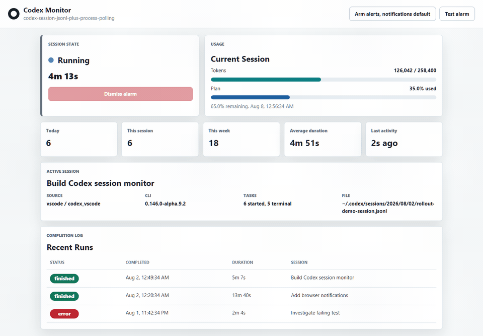
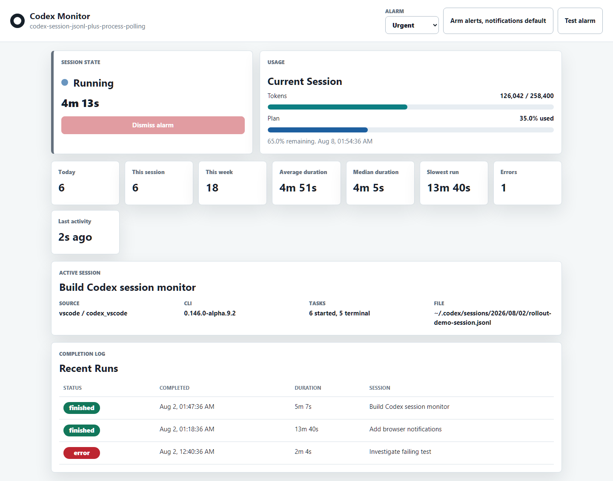
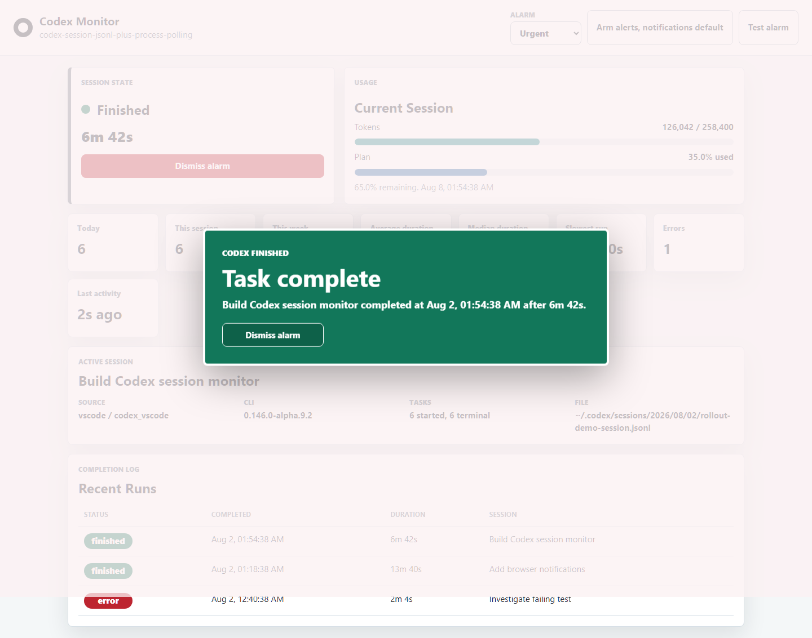

# Codex Session Monitor

[](LICENSE)
[](package.json)
[](#privacy)
[](https://github.com/amitwjace-creator/codex-session-monitor/actions/workflows/ci.yml)

A lightweight local dashboard that watches OpenAI Codex CLI sessions in real time and makes sure you notice the moment a task finishes.

Unofficial community tool. Not affiliated with or endorsed by OpenAI.

Codex is great at long-running work. This app is for the moment you tab away, get distracted, and miss that the agent is done. It watches local Codex session events, shows live status and usage, then fires a looping alarm, full-screen visual alert, and native notification when a run completes or errors.



Video: [watch the short MP4 demo](docs/demo.mp4)

## Screenshots





## Features

- Real-time session states: `idle`, `running`, `waiting_for_input`, `finished`, and `error`
- Completion detection even when the browser tab is in the background
- Looping audio alarm until dismissed
- Configurable alarm modes: urgent, gentle, or silent
- Full-screen flashing/bouncing completion alert
- Native browser notification as a backup
- Completion log with timestamp and duration
- Token usage, context usage, plan usage, and reset time when Codex exposes them
- Task counts for today, this session, and this week
- Average, median, and slowest task duration, plus error count and time since last activity
- Single dismiss action by click, `Esc`, `Enter`, or space
- Parser test suite for Codex JSONL event edge cases
- GitHub Actions CI for Node.js 18, 20, and 22
- Dependency-free runtime: Node.js plus static HTML/CSS/JS

## How It Works

This is a local Node-backed web app. Browser-only HTML cannot reliably read Codex files or inspect local processes, so the Node server watches the local Codex state on disk and serves a small dashboard.

The monitor reads:

- `%USERPROFILE%\.codex\sessions\**\*.jsonl` for structured rollout events such as `task_started`, `task_complete`, `turn_aborted`, and `token_count`
- `%USERPROFILE%\.codex\session_index.jsonl` for readable session names
- local process state as a secondary signal for `idle` vs. `waiting_for_input`

Codex CLI exposes `codex exec --json` for noninteractive event streams and `/status` inside interactive sessions, but this project does not rely on a documented live status API for arbitrary running interactive sessions. Parsing the local JSONL rollout files is the practical fallback. It is more reliable than scraping terminal stdout, but it may need updates if Codex changes its local event schema.

## Install

Requirements:

- Node.js 18 or newer
- OpenAI Codex CLI installed and writing sessions under `~/.codex`
- Optional backend audio support:
  - Windows: `Console.Beep`
  - macOS: `afplay`
  - Linux: `paplay`, `aplay`, or `ffplay`

Run without cloning:

```powershell
npx github:amitwjace-creator/codex-session-monitor
```

Clone and run:

```powershell
git clone https://github.com/amitwjace-creator/codex-session-monitor.git
cd codex-session-monitor
npm start
```

If PowerShell blocks `npm.ps1`, use:

```powershell
npm.cmd start
```

Open:

```text
http://127.0.0.1:3786
```

Press **Arm alerts** once after opening the page so the browser can enable audio and notification permissions.

## Usage

Keep the dashboard open while Codex is working. The server polls local session state once per second and streams updates to the page.

When Codex finishes or errors:

1. The page switches to `finished` or `error`.
2. A full-screen alert begins pulsing.
3. A looping alarm starts.
4. A native browser notification is sent if permission is granted and the page is not focused.
5. The run is written to the local completion log.

Dismiss the alert with the **Dismiss alarm** button, `Esc`, `Enter`, or space.

Use **Test alarm** to verify that audio, animation, notification permission, and dismiss all work before leaving a long Codex task unattended.

## Configuration

The app works with sensible defaults:

```text
HOST=127.0.0.1
PORT=3786
CODEX_HOME=%USERPROFILE%\.codex
ALARM_MODE=urgent
BACKEND_ALARM=on
```

Override them when starting the server:

```powershell
$env:PORT = "3790"
$env:CODEX_HOME = "C:\Users\you\.codex"
$env:ALARM_MODE = "gentle"
npm start
```

Alarm modes:

- `urgent`: more insistent tone pattern
- `gentle`: softer, slower tone pattern
- `silent`: visual alert and browser notification only

Set `BACKEND_ALARM=off` to disable the server-side audio loop while keeping browser audio available after **Arm alerts**.

Runtime logs and local completion history are stored under ignored local folders:

- `.data/`
- `.runtime/`
- `monitor.out.log`
- `monitor.err.log`

## Privacy

Codex Session Monitor runs locally. It does not send your session data to a third-party service.

The dashboard reads local Codex session metadata and token usage events. Public screenshots in this README use demo data rather than real local paths or prompts.

## Limitations

- The Codex JSONL event format is local/undocumented and may change.
- Usage and quota details appear only when Codex emits `token_count` events with rate-limit metadata.
- Native notification behavior depends on browser permission and OS settings.
- Linux backend audio depends on one of `paplay`, `aplay`, or `ffplay` being installed. Browser audio remains available after **Arm alerts**.

## Roadmap

See [ROADMAP.md](ROADMAP.md).

## Suggested GitHub Topics

`openai`, `codex`, `codex-cli`, `developer-tools`, `monitoring`, `dashboard`, `notifications`, `nodejs`, `local-first`, `productivity`

## Contributing

Contributions are welcome. Good first improvements include:

- More resilient Codex event parsing
- Better historical charts
- Tray app packaging
- Configurable alarm sounds

See [CONTRIBUTING.md](CONTRIBUTING.md) for local development notes.

## License

MIT. See [LICENSE](LICENSE).
